# Wallpaper Previews

Here is a preview of all wallpapers in this repository:

<a href='007.png'>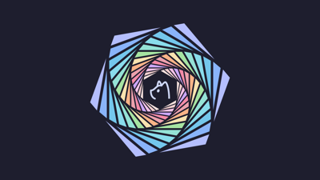</a>

<a href='36.png'>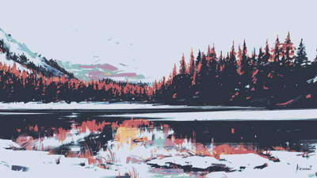</a>

<a href='3d-model.jpg'>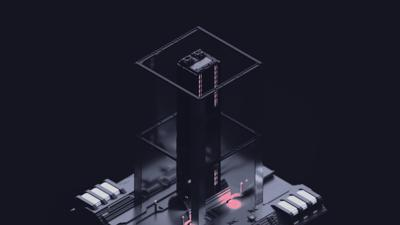</a>
<a href='3xsraffkwi1a1.png'>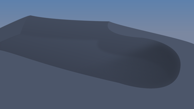</a>

<a href='48.png'>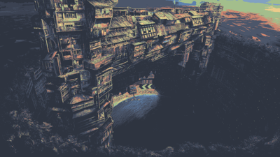</a>

<a href='54.png'>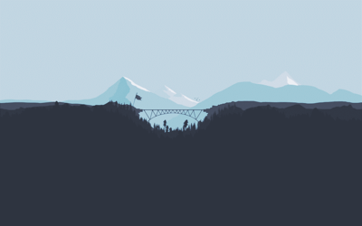</a>

<a href='73.png'>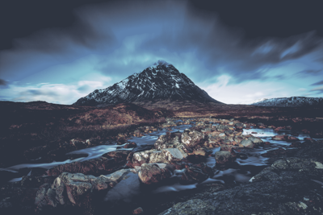</a>

<a href='Anime-Girl5.png'>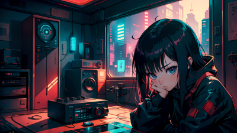</a>
<a href='Anime-Japan-Street.png'>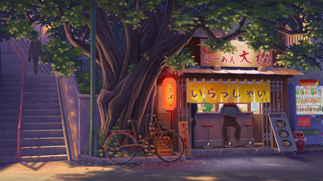</a>

<a href='Anime-Room.png'>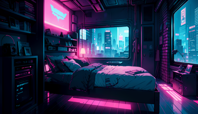</a>

<a href='Arch-chan_to.png'>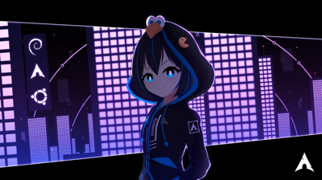</a>
<a href='Assetto_Corsa_8.jpg'>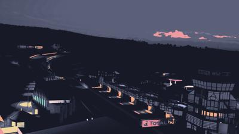</a>

<a href='Beach-Dark.png'>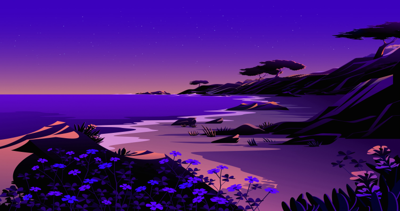</a>

<a href='Buildings.png'>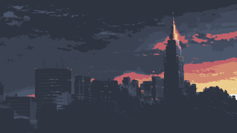</a>

<a href='City-Rainy-Night.png'>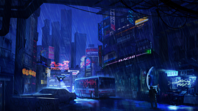</a>
<a href='City_dark.png'>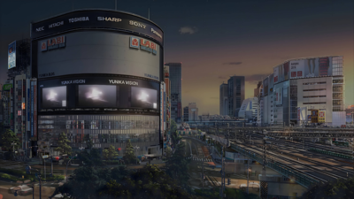</a>

<a href='Crater.png'>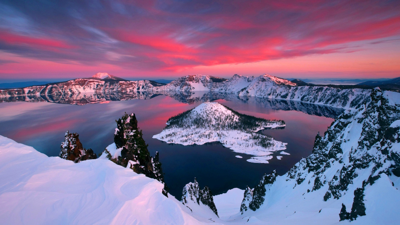</a>

<a href='Dark_Nature.png'>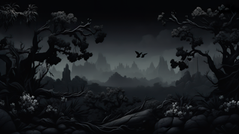</a>
<a href='Dessert-Dark.png'>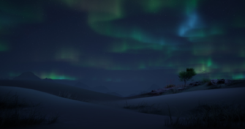</a>
<a href='Dreamy-Aesthetic-Home-Under-Moonlight.png'>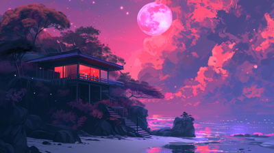</a>

<a href='Evangelion.png'>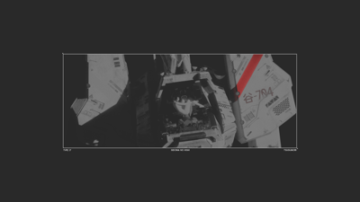</a>

<a href='Fantasy-Autumn.png'>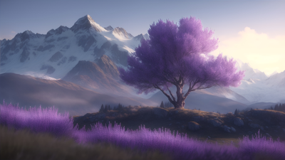</a>

<a href='Fantasy-Japanese-Street.png'>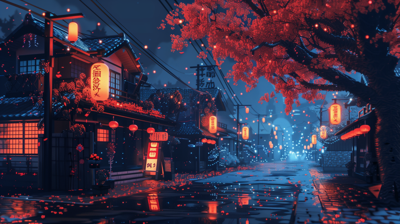</a>

<a href='Fantasy-Landscape2.png'>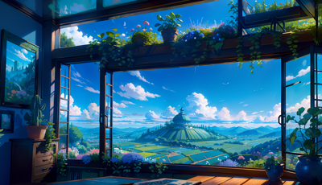</a>

<a href='Fantasy-Medieval_Travern.png'>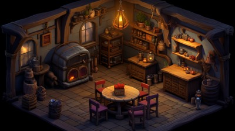</a>

<a href='Fantasy-Mountain.png'>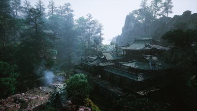</a>

<a href='FormulaOne_Rosberg_2.jpg'>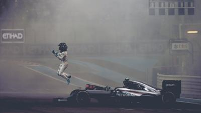</a>

<a href='GT-40.png'>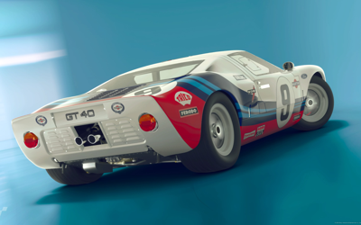</a>

<a href='Garden-Dark.png'>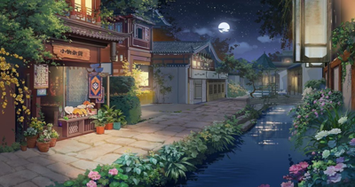</a>

<a href='IT_guy.png'>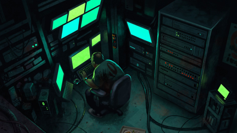</a>
<a href='Lady-Dark.png'>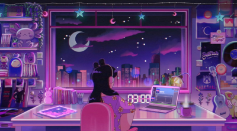</a>
<a href='Lady.png'>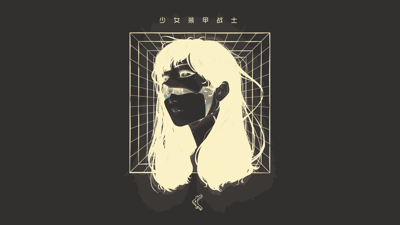</a>

<a href='Lake.png'>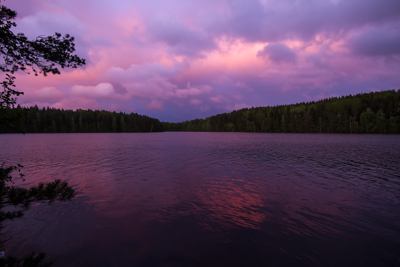</a>
<a href='Linux-user-Room.png'>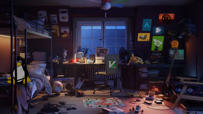</a>

<a href='Lofi-Cafe1.png'>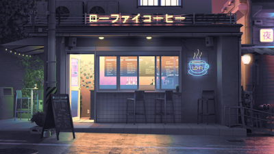</a>
<a href='Lofi-Cafe2.png'>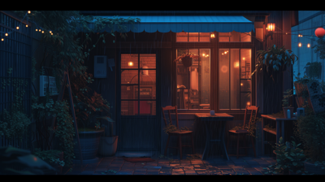</a>

<a href='Lofi_Cat.png'>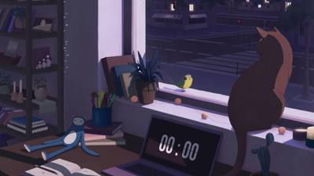</a>

<a href='Lowpoly_Street.png'>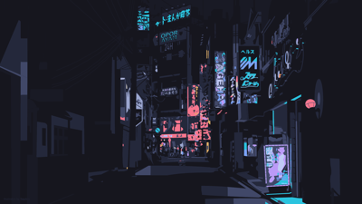</a>
<a href='Manga-Girl-Rain.png'>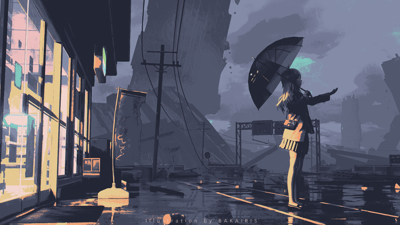</a>

<a href='Manga-Shrine.png'>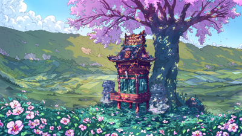</a>

<a href='Messy-Room.jpg'>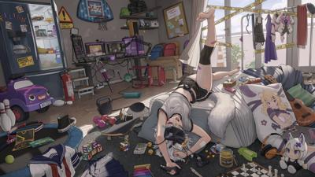</a>

<a href='Mocha-hald8-pinkish.jpg'>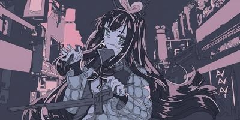</a>

<a href='Nature-Aurorae.png'>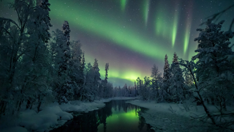</a>

<a href='Night_5760x2880px2.png'>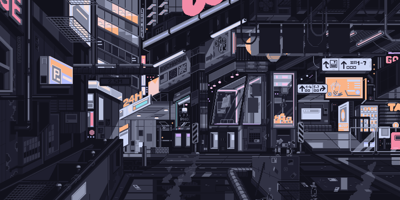</a>
<a href='Night_City.png'>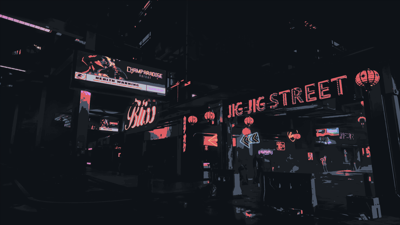</a>

<a href='Palette.png'>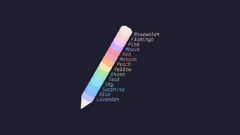</a>

<a href='Pastel-Window.png'>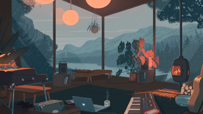</a>
<a href='Patterns.png'>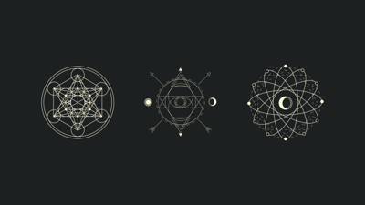</a>
<a href='RDT_20241230_1743584438277266288424584.jpg'>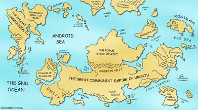</a>
<a href='RDT_20250607_1554367821381331680858185.jpg'>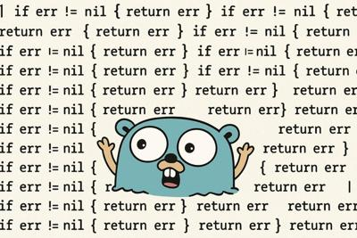</a>

